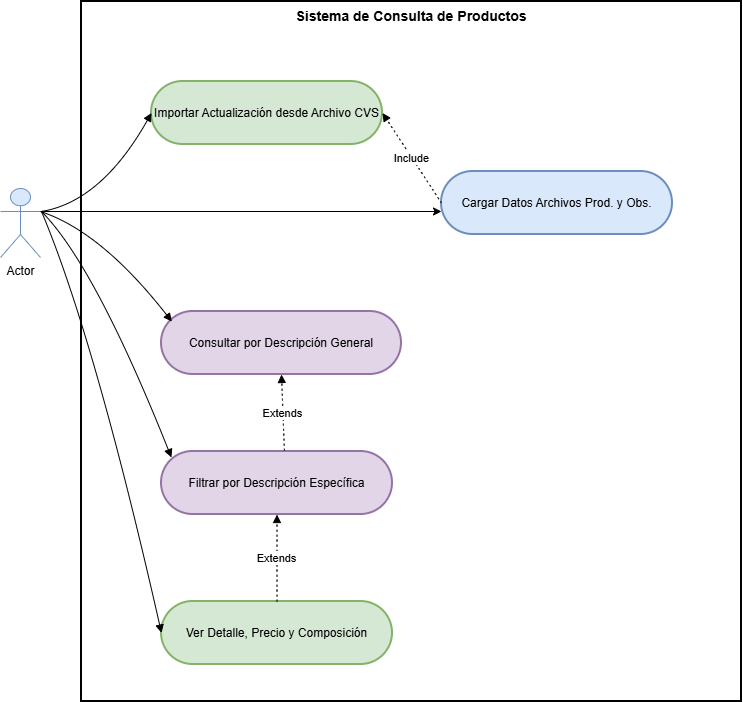
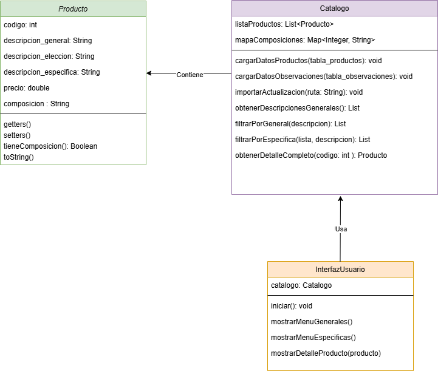
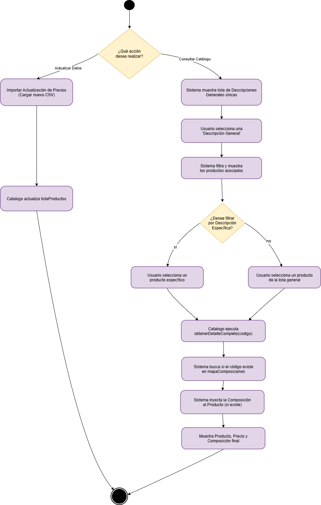
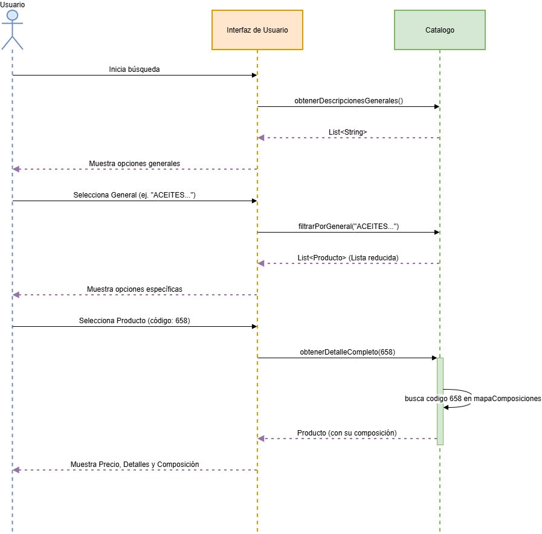

# Sistema de Consulta de Productos 🛒

Un sistema robusto y eficiente desarrollado en **Java 17** con interfaz gráfica **(Swing)** para la gestión, filtrado y generación de cotizaciones de un catálogo de productos. El sistema migra datos estructurados desde archivos .csv hacia una base de datos relacional embebida **(SQLite)**, permitiendo al usuario realizar búsquedas jerárquicas (de lo general a lo específico) o búsquedas libres por texto. Además, inyecta dinámicamente las composiciones de los productos mediante consultas **SQL (JOIN)** y permite exportar los listados resultantes directamente a WhatsApp.

## 🚀 Características Principales

* **⚙️ Arquitectura Backend y Persistencia Segura:** Integración con base de datos embebida (SQLite) que garantiza la retención segura de la información. Implementa Transacciones SQL (Commit/Rollback) para proteger el catálogo existente ante errores de lectura o archivos CSV corruptos, y utiliza procesamiento por lotes (Batching) para lograr la inserción de miles de registros en milisegundos.
* **🧠 Lógica de Negocio Avanzada:** El sistema gestiona y respeta la jerarquía relacional de los datos (Familia -> Grupo -> Productos específicos). Incorpora un motor de búsqueda dual (filtros en cascada y búsqueda libre por texto) y procesa la información en tiempo real, calculando sumatorias exactas para la generación de presupuestos.
* **🎨 Experiencia de Usuario (UX) Profesional:** Interfaz de escritorio desarrollada con Java Swing bajo un diseño institucional, limpio e intuitivo. Destaca por su sincronización inteligente de estados (reseteo automático de campos para evitar datos contradictorios), uso de placeholders y retroalimentación visual constante mediante cuadros de diálogo interactivos.
* **📱 Integración Comercial:** Transformación de las consultas en tickets detallados listos para el cliente. Cuenta con conectividad directa a la API de WhatsApp (wa.me), lo que permite exportar y enviar la cotización completa de manera automatizada con un solo clic.

## 🛠️ Tecnologías Utilizadas

* **Lenguaje:** Java 17
* **Paradigma:** Programación Orientada a Objetos (POO)
* **Diseño de Arquitectura:** UML (Casos de Uso, Clases, Actividades, Secuencia) modelado en Draw.io.

---

## 📷 Capturas de Pantalla

A continuación te mostramos cómo se ve la aplicación:


---


---

## 📐 Arquitectura y Diseño del Sistema

A continuación se detallan los diagramas UML que respaldan la arquitectura de la solución:

### 1. Diagrama de Casos de Uso
Define las interacciones principales del usuario con el sistema, incluyendo la carga de datos y las extensiones de búsqueda.

> 

### 2. Diagrama de Clases
Muestra la estructura orientada a objetos, destacando la separación de responsabilidades entre el `modelo.Producto`, el `dao.Catalogo` (cerebro del filtrado) y la `vista.InterfazUsuario`.

> 

### 3. Diagrama de Actividades
Ilustra el flujo de ejecución paso a paso, desde que el usuario elige una acción (Consultar o Actualizar) hasta que el sistema muestra el detalle final.

> 

### 4. Diagrama de Secuencia
Representa la línea de tiempo de los mensajes entre los objetos cuando se realiza la consulta de un producto y su composición.

> 

---

## 🔧 Instalación y Uso

Si deseas correr este proyecto localmente:

1.  Clona el repositorio:
    ```bash
    git clone [https://github.com/SonyGahan/Catalogo_de_Productos-Mi_Tienda.git](https://github.com/SonyGahan/Catalogo_de_Productos-Mi_Tienda.git)
    ```
2.  Ejecuta el programa para comenzar a trabajar con la tienda.

---

## 💡 Contribuciones

Las contribuciones son bienvenidas. Si deseas mejorar el proyecto o agregar nuevas funcionalidades, sigue estos pasos:

1. **Haz un Fork** del repositorio.
2. Crea una nueva rama con una descripción clara:
   ```bash
   git checkout -b nueva-funcionalidad
   ```
3. Realiza tus cambios y haz un commit:
   ```bash
   git commit -m "Agrega nueva funcionalidad X"
   ```
4. Sube los cambios a tu repositorio remoto:
   ```bash
   git push origin nueva-funcionalidad
   ```
5. Crea un **Pull Request** en este repositorio.

---

## 📬 Contacto

Si tienes alguna duda o sugerencia, puedes contactarme a través de GitHub:

[GitHub: SonyGahan](https://github.com/SonyGahan)

---

## 📝 Licencia

Este proyecto está bajo la **Licencia MIT**. Consulta el archivo [LICENSE](LICENSE) para más detalles.

---

## 💻 Agradecimientos

🚀 Gracias por visitar mi repositorio y por tu interés en este proyecto. ¡Espero que te sea útil! 😄

## ⌨️ Construido con ❤️ por Sony Gahan 😊